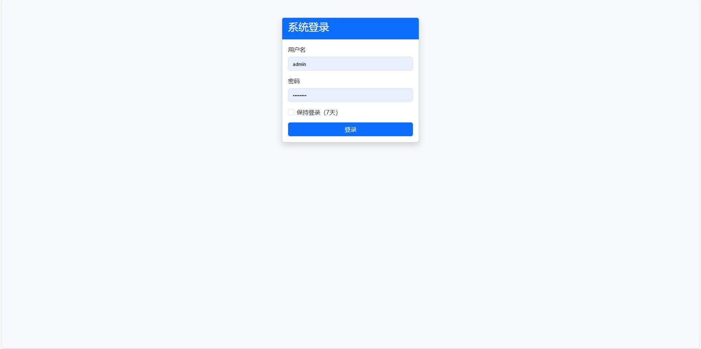
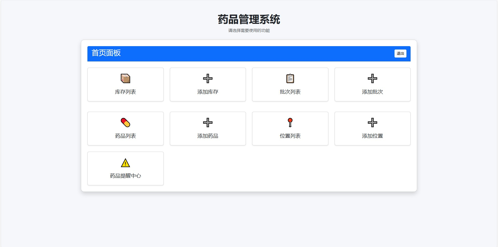
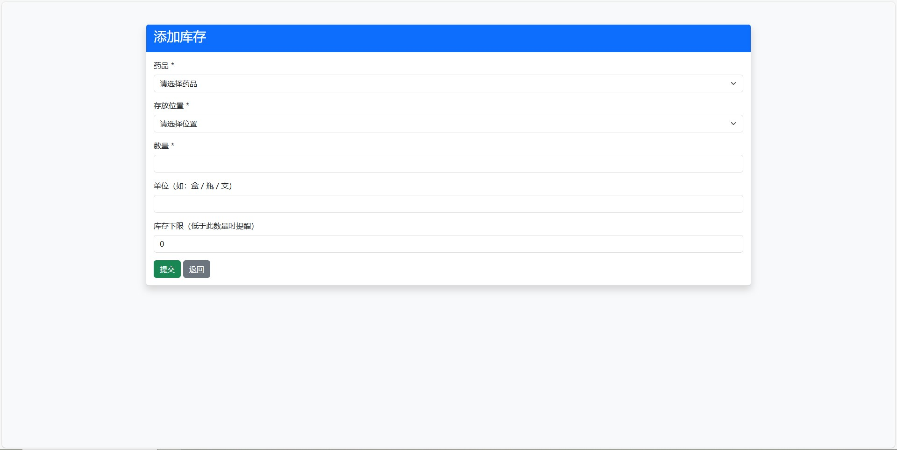

# medicine management
I have noticed that since the COVID-19 pandemic, many families or individuals have chosen to stockpile some medicines at home for emergencies. However, people often forget the expiration dates of medicines. This project is mainly used to manage and check the expiration dates of medicines so that expired medicines can be updated and disposed of in a timely manner.  

## 📚 Table of Contents
- [Main functions](#-Main-functions)
- [Screenshots](#-Screenshots)
- [Language support](#-Language-Support)
- [Install](#-Install)
- [Requirements](#-Requirements)
- [Roadmap](#-Roadmap)
- [License](#-License)
- [Contributors](#-contributors)

---
## 📜 Main functions
This system mainly has the following functions:  
- Add drug information  
- Add storage location information  
- Linked processing of inventory quantity  
- Reminder about near-expired/expired medications  

---
## 📜 Screenshots

Click to expand screenshots

Here are some interface previews of the system:

---
## 📜 Language Support

- The current version of this project **only supports Chinese (Simplified)**.
- All UI text, database content, and most code comments are written in Chinese.
- English support may be added in future versions.

---
## 📜 Install
Windows + XAMPP  
1. Copy the [medicine](./medicine) folder into your `/XAMPP/htdocs`  
2. Create the database table in MYSQL required by `medicine_system.sql`  
   The database initially contained only one user's data; the other tables were empty.  
3. Visit `http://localhost/medicine/auth/login.php`  
   The default admin username is `Admin`  
   The default admin password is `123456` 

   The default viewer username is `Viewer`  
   The default viewer password is `123456`  
4. Configure database connection information at `/XAMPP/htdocs/medicine/config/db.php`  
   The default HOST is `localhost`  
   The default USER is `root`  
   The default PASS is (none)  
   The default NAME is `medicine_system`  

---
## 📜 Requirements
- PHP >= 7.4
- MySQL >= 5.7
- XAMPP or any Apache + PHP environment
- Browser that supports ES6

---
## 📜 Roadmap
- [ ] Add multi-user support
- [ ] Add mobile-friendly UI
- [ ] Add barcode scanning for medicines

---
## 📜 License
This project is licensed under the GNU General Public License v3.0 (GPL-3.0).
This means any modified versions or derivative works must also be distributed under the same license.

See the [LICENSE](LICENSE) file for full details.

---
## 📜 Contributors

Made with [contrib.rocks](https://contrib.rocks).
